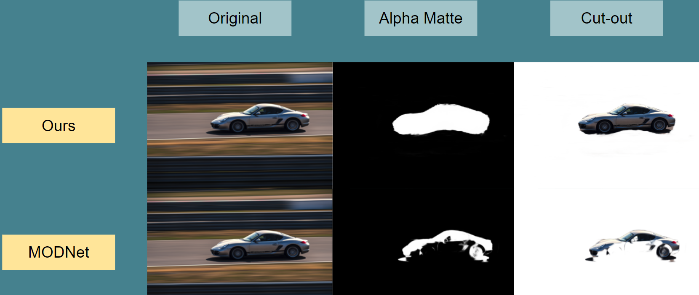
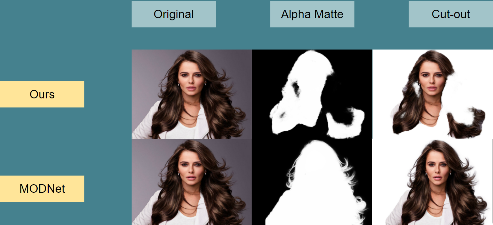

<h1 align="center"> <strong>AI powered Background-Remove</strong> </h1>


> <p> <strong> Removing the Background never been this easy !! </strong> </p>

---

## **Table of Contents**
Your section headers will be used to reference the location of the destination.

- [Description](#description)
- [How To Use](#how-to-use)
- [Repo Artitecture](#repo-artitecture)
- [Next Step](#next-step)
- [License](#license)
- [Author Info](#author-info)

---

## **Description**

<p align="justify">
For portrait matting without the green screen1, existing works either require auxiliary inputs that are costly to obtain or use multiple models that are computationally expensive. Consequently, they are unavailable in real-time applications.
</p>

<strong> Objectives </strong>

* Use computer vision techniques to remove the background from a still 2D image.
* Exploration of pre-trained models for image background removal.
* (Optional) Deployment of model for end-customers.

<strong>Data Sources</strong>
<p align="justify">
To train our machine learning model, we use the DUTS Image Dataset: As of June 2021, this is the largest saliency detection benchmark. It comprises of
</p>

* 10,553 training images
* 5,019 test images

<p align="justify">
References: Lijun Wang, Huchuan Lu, Yifan Wang , Mengyang Feng, Dong Wang, Baocai Yin, Xiang Ruan, "Learning to Detect Salient Objects with Image-level Supervision", CVPR2017
</p>

<br/>

## **Technologies**
<br/>

| Library          | Used to                                        |
| ---------------- | :----------------------------------------------|
| Numpy            | To handle Numpy arrays                         |
| Pandas           | To store and access info in a DataFrame        |
| Matplotlib       | To plot the data                               |
| OpenCV           | To read, modify, generate image & video        |
| jupyter          | To open Jupyter Notebook                       |
| TensorFlow       | To make use of the Keras framework             |
| pillow           | To work with images                            |
| h5py             | To save and load models                        |
| MODNet           | To get the image cut out                        |
| U-2-Net          | To get the Trimap using by finding Alpha matte     |


[**↥ Back To The Top**](#table-of-contents)

---

## **How To Use**

### **Installation** 

`Python Ver. '3.8'`

1. Open terminal `cmd`
2. Install the required libraries  `pip install -r requiement.txt`
3. Change working directory to 'main' directory `cd main`
4. Run the app.py python script `python app.py`
5. Follow the instruction and run locally `127.0.0.1:5000`


[**↥ Back To The Top**](#table-of-contents)

---

## **Repo Artitecture**
```
Remove_Image_Background
│   README.md                     :explains the project
│   requirements.txt              :packages to install to run the program
│   .gitignore                    :specifies files & directories to exclude from GitHub
│   
│
└───exploration                   :director that contains all exploration notebooks
│   │
│   |───images                    :images of progressing results of the alpha matte.                        
│   │
│   │───1_predict_u2net_alpha_matte.ipynb   :exploration for generating alpha matte.
│   │───2_generate_trimaps.ipynb            :exploration for generating trimaps.
│   │───3_train_model.ipynb                 :exploration for training the models.
│   │───test_dashboard.ipynb                :testing for script and function for dashboard.
│   └───test_model.ipynb                    :testing the script and function to generate model
│
└───main                          :director that contains all the main script for program
│   │
│   |───model_checkpoint                        
│   |   └───model_checkpoint.pth  :training checkpoint of the model for the background removal
│   │
│   └───static                        
│   |   |───bgrm_result           :background removed image result folder.
│   |   |───image                 :direct that contains all the test and html design images.
│   |   └───upload                :directory where user upload photos are stored for background removal.
│   │
│   └───templates                        
│       |───index.html            :home page for user to easy use of the application
│       └───result.html           :html page for user to easy access and download of the image after background removal.
```

[**↥ Back To The Top**](#table-of-contents)

---

## **Result Preview**

 
<br/>
 

[**↥ Back To The Top**](#table-of-contents)

---

## **Next Step**

- Improve the dashboard for more interaction.
- Improve the cut out of the image.
- Addition feature, video background removable
- Further improve the model, training on different dataset.

[**↥ Back To The Top**](#table-of-contents)

---
## **License**

Copyright (c) [2021] [Derrick Van Frausum, Joren Vervoort, Sijal Kumar Joshi]

<p align="justify">
Permission is hereby granted, free of charge, to any person obtaining a copy
of this software and associated documentation files (the "Software"), to deal
in the Software without restriction, including without limitation the rights
to use, copy, modify, merge, publish, distribute, sublicense, and/or sell
copies of the Software, and to permit persons to whom the Software is
furnished to do so, subject to the following conditions:
</p>
<p align="justify">
The above copyright notice and this permission notice shall be included in all
copies or substantial portions of the Software.
</p>
<p align="justify">
THE SOFTWARE IS PROVIDED "AS IS", WITHOUT WARRANTY OF ANY KIND, EXPRESS OR
IMPLIED, INCLUDING BUT NOT LIMITED TO THE WARRANTIES OF MERCHANTABILITY,
FITNESS FOR A PARTICULAR PURPOSE AND NONINFRINGEMENT. IN NO EVENT SHALL THE
AUTHORS OR COPYRIGHT HOLDERS BE LIABLE FOR ANY CLAIM, DAMAGES OR OTHER
LIABILITY, WHETHER IN AN ACTION OF CONTRACT, TORT OR OTHERWISE, ARISING FROM,
OUT OF OR IN CONNECTION WITH THE SOFTWARE OR THE USE OR OTHER DEALINGS IN THE
SOFTWARE.
</p>

[**↥ Back To The Top**](#table-of-contents)

---

## **Authors Info**

- Linkedin -  [Derrick Van Frausum](https://www.linkedin.com/in/derrick-van-frausum/), [Joren Vervoort](https://github.com/Joren-Vervoort), [Sijal Kumar Joshi](https://www.linkedin.com/in/sijal-kumar-joshi-b1545584/)
- Github   - [Derrick Van Frausum](https://github.com/DerrickDDInAI), [Joren Vervoort](https://github.com/Joren-Vervoort), [Sijal Kumar Joshi](https://github.com/sijal001)

[**↥ Back To The Top**](#table-of-contents)
