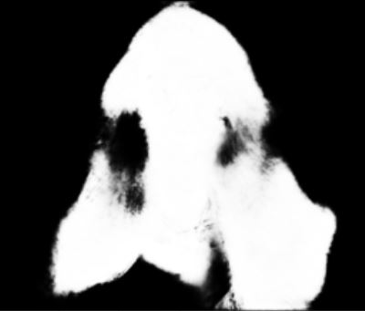
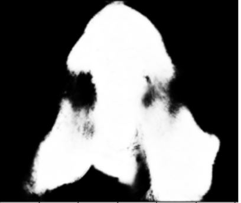
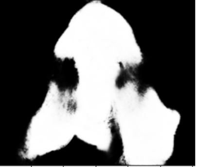

<h1 align="center"> <strong>AI powered Background-Remove</strong> </h1>


> <p> <strong> Removing the Background never been this easy!! </strong> </p>

---

## **Table of Contents**
Your sections headers will be used to reference the location of destination.

- [Description](#description)
- [How To Use](#how-to-use)
- [Repo Artitecture](#repo-artitecture)
- [Next Step](#next-step)
- [License](#license)
- [Author Info](#author-info)

---

## **Description**

<p align="justify">
For portrait matting without the green screen1, existing works either require auxiliary inputs that are costly to obtain or use multiple models that are computationally expensive. Consequently, they are unavailable in real-time applications.
</p>

<strong> Objectives </strong>

* Use computer vision techniques to remove the background from a still 2D image.
* Exploration of pre-trained models for image background removal.
* (Optional) Deployment of model for end-customers.


<br/>

## **Technologies**
<br/>

| Library          | Used to                                        |
| ---------------- | :----------------------------------------------|
| Numpy            | To handle Numpy arrays                         |
| Pandas           | To store and access info in a DataFrame        |
| Matplotlib       | To plot the data                               |
| OpenCV           | To read, modify, generate image & video        |
| jupyter          | To open Jupyter Notebook                       |
| TensorFlow       | To make use of the Keras framework             |
| pillow           | To work with images                            |
| h5py             | To save and load models                        |
| MODNet           | To get the image cut out                        |
| U-2-Net          | To get the Trimap using by finding Alpha matte     |


[**↥ Back To The Top**](#table-of-contents)

---

## **How To Use**

### **Installation** 

`Python Ver. '3.8'`

**Note:** Just use the command below to install the required library with the correct version to run the program smoothly.

`pip install -r requiement.txt`


1. After the required library install basic application can be run by just running `app.py` python script.

2. 


[**↥ Back To The Top**](#table-of-contents)

---

## **Repo Artitecture**
```
Remove_Image_Background
│   README.md               :explains the project
│   requirements.txt        :packages to install to run the program
│   .gitignore              :specifies files & directories to exclude from GitHub
│   main.py                 :script to run in order to start the program
│
└───core                    :contains all the core scripts of the program
│   │   __init__.py
│   │
│   └───assets              
│       ├───data
│       ├───images
│       └───models

```

[**↥ Back To The Top**](#table-of-contents)

---

## **Result Preview**

 
&nbsp;&nbsp;&nbsp;&nbsp;&nbsp;&nbsp;
 
<br/><br/>

&nbsp;&nbsp;&nbsp;&nbsp;&nbsp;&nbsp;


[**↥ Back To The Top**](#table-of-contents)

---

## **Next Step**

- Improve the dashboard for more interaction.
- Improve the cut out of the image
- Addition feature, video background removable
- Better improve for the image 

[**↥ Back To The Top**](#table-of-contents)

---
## **License**

Copyright (c) [2021] [Derrick Van Frausum, Joren Vervoort, Sijal Kumar Joshi]

<p align="justify">
Permission is hereby granted, free of charge, to any person obtaining a copy
of this software and associated documentation files (the "Software"), to deal
in the Software without restriction, including without limitation the rights
to use, copy, modify, merge, publish, distribute, sublicense, and/or sell
copies of the Software, and to permit persons to whom the Software is
furnished to do so, subject to the following conditions:
</p>
<p align="justify">
The above copyright notice and this permission notice shall be included in all
copies or substantial portions of the Software.
</p>
<p align="justify">
THE SOFTWARE IS PROVIDED "AS IS", WITHOUT WARRANTY OF ANY KIND, EXPRESS OR
IMPLIED, INCLUDING BUT NOT LIMITED TO THE WARRANTIES OF MERCHANTABILITY,
FITNESS FOR A PARTICULAR PURPOSE AND NONINFRINGEMENT. IN NO EVENT SHALL THE
AUTHORS OR COPYRIGHT HOLDERS BE LIABLE FOR ANY CLAIM, DAMAGES OR OTHER
LIABILITY, WHETHER IN AN ACTION OF CONTRACT, TORT OR OTHERWISE, ARISING FROM,
OUT OF OR IN CONNECTION WITH THE SOFTWARE OR THE USE OR OTHER DEALINGS IN THE
SOFTWARE.
</p>

[**↥ Back To The Top**](#table-of-contents)

---

## **Authors Info**

- Linkedin -  [Derrick Van Frausum](https://www.linkedin.com/in/derrick-van-frausum/), [Joren Vervoort](https://github.com/Joren-Vervoort), [Sijal Kumar Joshi](https://www.linkedin.com/in/sijal-kumar-joshi-b1545584/)
- Github   - [Derrick Van Frausum](https://github.com/DerrickDDInAI), [Joren Vervoort](https://github.com/Joren-Vervoort), [Sijal Kumar Joshi](https://github.com/sijal001)

[**↥ Back To The Top**](#table-of-contents)
